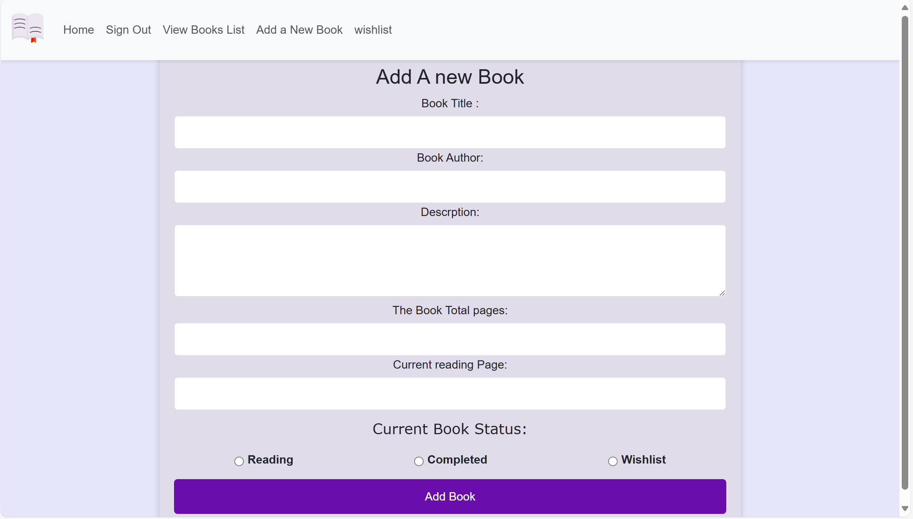
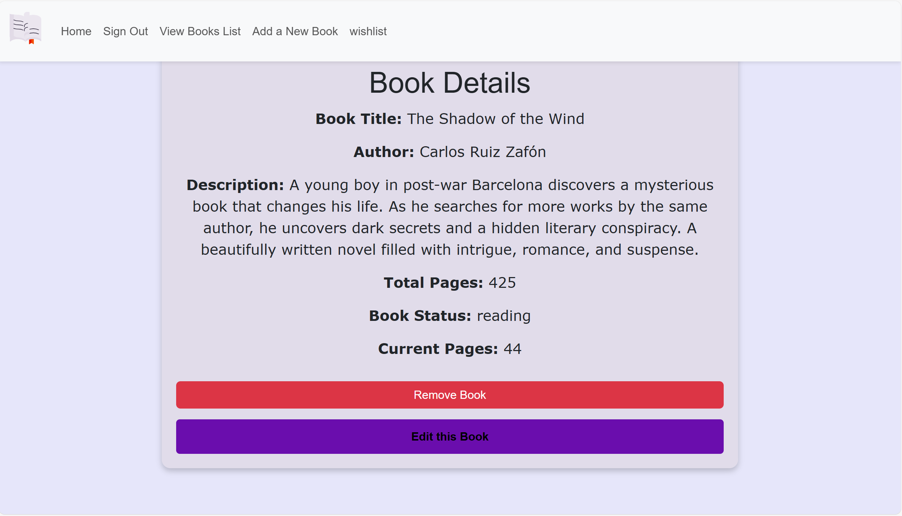

**Screen Shot**

**My project Name is BookTracker**

  - The users must sign in or sign up to use the Book Tracker. This personal tracker is aimed to people who love to read and want to track their reading progress for a current book 

**Getting started**

- the project link :

- After the book is added, the user can see a list which includes all the added books. In addition, they can easily access the wishlist to see the book names.

- after the book is add the user can see a list which include all the added books , in addtion they can easily accces the whilist to see the book name .

- The user can easily edit the book form and also can permanently remove the book from the book list.

**Technologies used**
- JavaScript
- HTML 
- CSS
- MongoDB
- npm packages

**Next steps**

- Users can upload images of their books.

- Users  have the option to share their book tracking with other users on the same website. 

